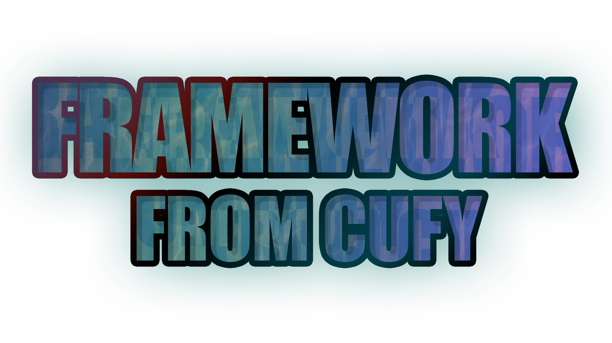

PLEASE use 0.1.4 version, since 0.1.5 is still under-develoopment!

  

  <b>A Framework to be Inherited</b>

    
    
    
    
    
    
    

-   ### About
    The main project of the cufy organization. The framework is written in java.
    The framework tries to compete with other frameworks. The cufy framework is
    focused on to be more inheritable and more reflection friendly. Making it 
    more reliable in big complex projects. The framework still not completely
    ready to be used in really big projects since it is still in the beta stage.
    - Legacy: https://github.com/cufyorg/framework/blob/master/site/legacy.html

-   ### Guide
    The user guide can be found ether in the javadoc or the official website of the framework. 
    -   Website: https://framework.cufy.org
    -   Javadoc: https://framework.cufy.org/javadoc
    -   Jitpack: https://jitpack.io/#org.cufy/framework
    -   Youtube: https://www.youtube.com/playlist?list=PL4GvMdlkZJ6Y1SkrorANkRHArohilF2Ye

-   ### Contributing
    The you can view the guid lines of our contributors here:
    -   Code Of Conduct: https://github.com/cufyorg/framework/blob/master/CODE_OF_CONDUCT.md
    -   Contributing Guid Lines: https://github.com/cufyorg/framework/blob/master/CONTRIBUTING.md

-   ### Support
    If you have any problem or have a feature request please submit an issue here:
    -   Github: https://github.com/cufyorg/framework/issues/new/choose
    
    Or fill one of these templates:
    -   Bug Report: https://github.com/cufyorg/framework/blob/master/.github/ISSUE_TEMPLATE/bug_report.md
    -   Feature Request: https://github.com/cufyorg/framework/blob/master/.github/ISSUE_TEMPLATE/feature_request.md

    And send it to one of the following:
    -   Repository Email: framework@cufy.org
    -   Support Email: support@cufy.org
    -   Admin Email: admin@cufy.org
    -   Discord: https://discord.gg/ASAGGy7
    -   Gitter: https://gitter.im/cufyorg/community

-   ### Licence
    Copyright 2020 Cufy

    Licensed under the Apache License, Version 2.0 (the "License");
    you may not use this file except in compliance with the License.
    You may obtain a copy of the License at

    http://www.apache.org/licenses/LICENSE-2.0

    Unless required by applicable law or agreed to in writing, software
    distributed under the License is distributed on an "AS IS" BASIS,
    WITHOUT WARRANTIES OR CONDITIONS OF ANY KIND, either express or implied.
    See the License for the specific language governing permissions and
    limitations under the License.
